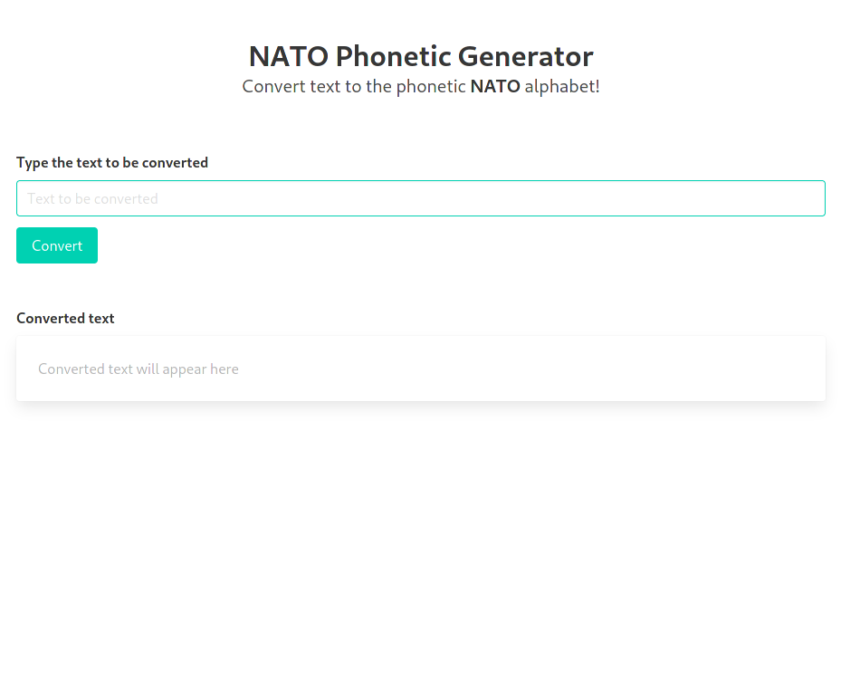

# NATO Phonetic Generator

<!--  -->

This is a simple JavaScript app that converts text into a phonetic NATO alphabet output. It is useful when you have to spell a word to someone that is not understanding you.

## Screenshot

## Prerequisites

There are no prerequisites. Just go to the URL and start converting

## Using NATO Phonetic Generator

Just browse to: https://natogenerator.netlify.app/

## Contributing to NATO Phonetic Generator
To contribute to NATO Phonetic Generator, follow these steps:

1. Fork this repository.
2. Create a branch: `git checkout -b <branch_name>`.
3. Make your changes and commit them: `git commit -m '<commit_message>'`
4. Push to the original branch: `git push origin infinite-dogs/<location>`
5. Create the pull request.

Alternatively, see the GitHub documentation on [creating a pull request](https://help.github.com/en/github/collaborating-with-issues-and-pull-requests/creating-a-pull-request).

## Maintainer & Contributors
* [@guinuxbr](https://github.com/guinuxbr)

## Contact
If you want to contact me you can send an email to guinuxbr@gmail.com.

## License
This project uses the following license: [GNU GPLv3](https://www.gnu.org/licenses/gpl-3.0.html).
